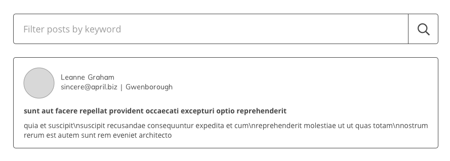

# ResassAssessment

This project was generated with [Angular CLI](https://github.com/angular/angular-cli) version 7.0.3.

## Development server

Run `ng serve` for a dev server. Navigate to `http://localhost:4200/`. The app will automatically reload if you change any of the source files.

## Code scaffolding

Run `ng generate component component-name` to generate a new component. You can also use `ng generate directive|pipe|service|class|guard|interface|enum|module`.

## Build

Run `ng build` to build the project. The build artifacts will be stored in the `dist/` directory. Use the `--prod` flag for a production build.

## Running unit tests

Run `ng test` to execute the unit tests via [Karma](https://karma-runner.github.io).

## Running end-to-end tests

Run `ng e2e` to execute the end-to-end tests via [Protractor](http://www.protractortest.org/).

## Further help

To get more help on the Angular CLI use `ng help` or go check out the [Angular CLI README](https://github.com/angular/angular-cli/blob/master/README.md).


# RESAAS Front End Technical Assessment

The primary goal of this technical assessment is to gauge your abilities in javascript, html and css.

- Start whenever you are ready but please get back to us within 7 days.
- Take whatever time you need to setup your environment but once you start coding you should spend maximum of 3 hours on this.
- You are NOT required or expected to complete everything. Simply do what you can in the time allotted.
- Focus on the areas which you believe to be important and will best reflect your abilities.
- Be prepared to talk about challenges, next steps and the code you wrote during the next interview.
- If you have any questions feel free to reach out.
- When you are done please check your work into github and let us know you're finished by email.

## mockup

This is a very simple visual design. The goal should be to get your work looking as close to this as possible.



## requirements

Functionally the project should retrieve data from two different web services and render a list of posts each of which contain the post title and body as well as information about the author including name, email and city.

On page load the user should see a list containing all the posts. They then have the option to filter the posts using a keyword.

Feel free to change any of the files in this repo and use any technology or approach you wish but the above stated goals should remain the same.

### html

Well organized, semantic HTML should be used so it is easy for users, developers and search engines to understand the content.

### css

CSS should be clean, minimal and support all modern browsers. Ideally the page will work well on screens of all sizes.

### javascript

Frameworks, libraries and tools are up to you but code should be functional, legible and easy to understand.

## development environment

To get you started we have included a simple web server. You do not need to use this, it is just meant to be helpful. If you prefer other tools go ahead and use them but please ensure anything required to run your project is defined in package.json so we can run your solution on our machines. If special instructions are need please update this file, readme.md.

### http-server

To get it installed simply run `> npm install`.

Once everything is installed you can start it by running `> node node_modules/http-server/bin/http-server` from the project root.

It will tell you where the site is available, usually `http://127.0.0.1:8080`

## data

All the data you will need can be retrieved from [jsonplaceholder](https://jsonplaceholder.typicode.com) and the following two web services:

- https://jsonplaceholder.typicode.com/users
- https://jsonplaceholder.typicode.com/posts

## markup

index.html contains an extremely simple example of what _could_ be the final markup. This is only to provide an example of what interface elements and data should be visible.

```
<form>
	<fieldset>
		<input placeholder="Filter posts by keyword">
		<button>search</button>
	</fieldset>
</form>
<div>
	<div>
		<div>
			
			<p>{{user.name}}</p>
			<p>{{user.email}} | {{user.address.city}}</p>
		</div>
		<p><strong>{{post.title}}</strong></p>
		<p>{{post.body}}</p>
	</div>
</div>
```

